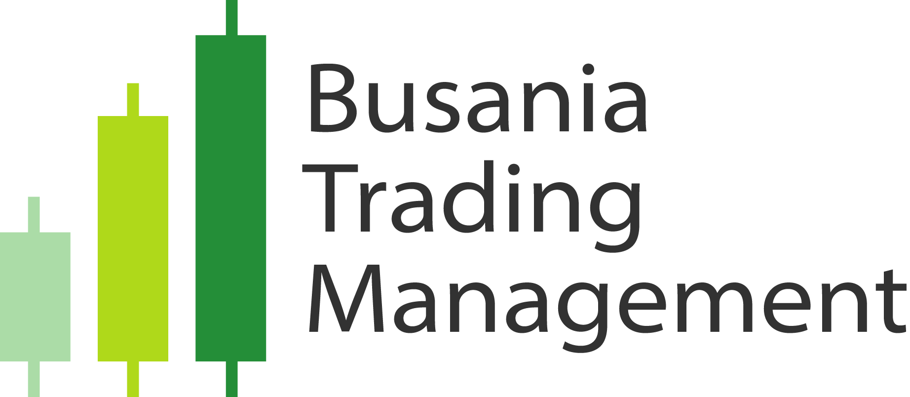
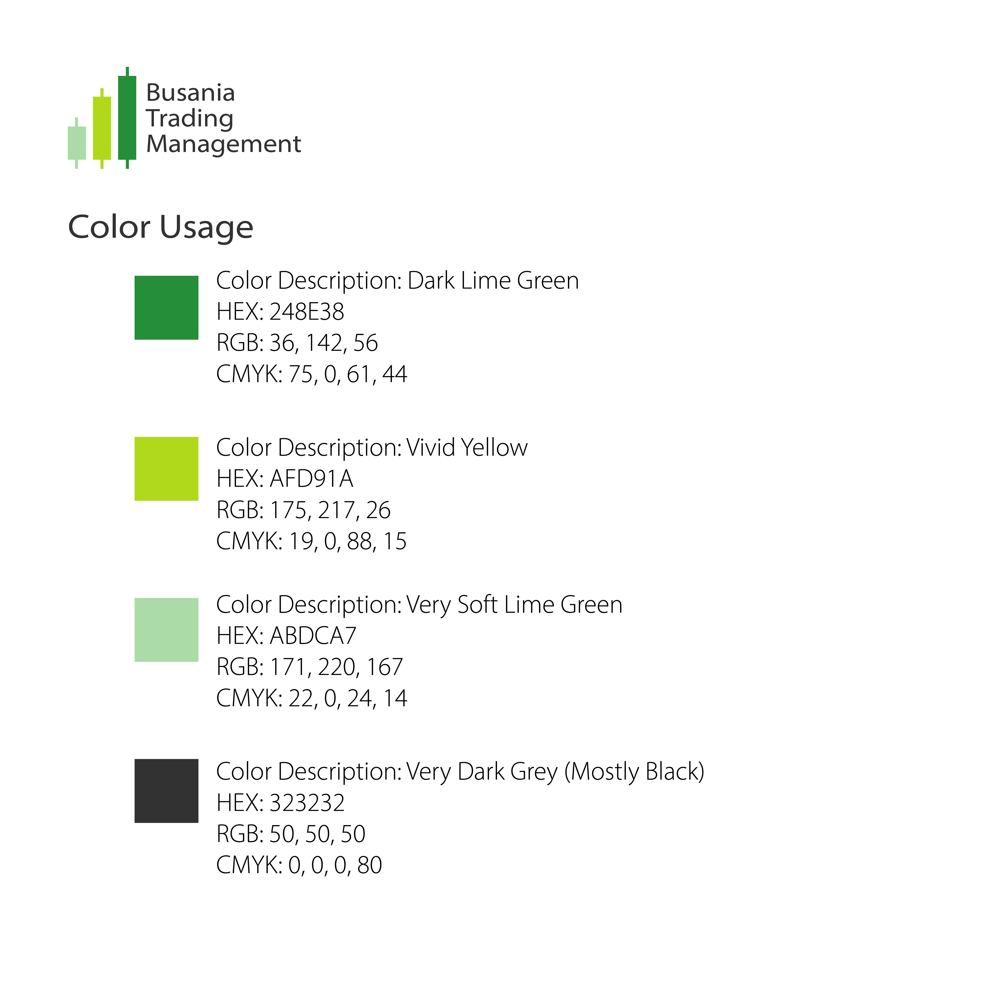
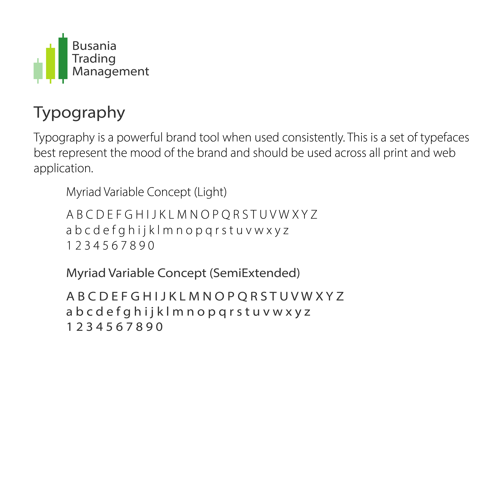

## Busania Trading Management Brand Identity

### Logo

Busania Trading Management (BTM) features a straightforward logo design. The emblem comprises three candles progressively ascending, with the green color intensifying, symbolizing the continuous improvement of investments with BTM's support. This primary logo serves as the focal point for major brand promotions, ensuring consistent and easily recognizable branding across diverse platforms. It is imperative to adhere to the provided branding guide before deploying the logo.

For situations with limited space or specific design requirements, BTM's secondary logo consists solely of the three candles, omitting the company name. Exercise caution and reserve the use of the secondary logo for instances where space constraints necessitate such a choice.

Furthermore, BTM's secondary badge can serve as an alternative to the primary logo but should never be placed in direct proximity. Avoid deploying the secondary badge alongside the primary logo, particularly in banner logos, as this may appear repetitive and compromise the brand's representation. Always consider the guidelines outlined in the branding guide when incorporating BTM's logos into various contexts.

### Mood Board

• Sustainability
  
• Financial Freedom

• Assurance

The inspiration behind this logo emanates from these three overarching moods. The design is a visual representation of the company's mission to foster financial stability for all through strategic investments. Additionally, the logo aims to instill a sense of assurance, signifying the company's commitment to guiding individuals in their investment endeavors.

The logo is intricately crafted to evoke a perception of premium service, reinforcing the company's dedication to providing only the highest quality experiences for its clientele. For a comprehensive understanding of the logo's nuances and appropriate usage, detailed explanations are expounded upon in the subsequent sections of the logo guide.

Adherence to the guidelines delineated in the logo guide is imperative to ensure a cohesive and harmonized utilization of the logo across the company's diverse platforms. Consistent application of these principles will contribute to a unified visual identity, reinforcing the brand's presence and impact.

### Color Usage

### Typography

### Project Summary

The project involved the creation of a brand identity for Busania Trading Management (BTM), a startup specializing in trading assistance and wealth management. The primary logo features three ascending candles, symbolizing continuous improvement and financial growth with BTM. Emphasizing sustainability, financial freedom, and assurance, the logo reflects the company's mission to ensure financial stability for its clients.

The design aims to convey the company's commitment to guiding individuals in their investment journey and assuring them of the best service. The secondary logo, showcasing only the three candles without the company name, provides a space-efficient alternative. The detailed guidelines for logo usage are outlined in the accompanying guide, emphasizing the importance of a unified and synchronized brand representation across diverse platforms for a cohesive visual identity.

